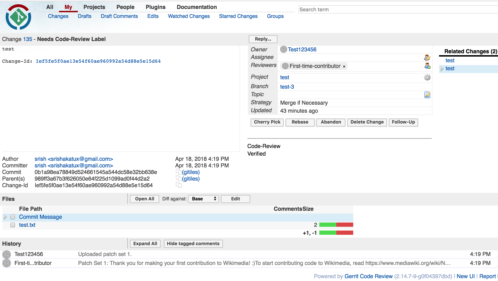

gerrit-newcomer-bot
===================

Gerrit newcomer bot for Wikimedia Foundation’s Gerrit

It attempts at helping DevRel’s in two ways: a) provides a solution to welcome newcomers and b) a process to query newcomer patches. It typically does two things: a) adds a reviewer ("first-time-contributor") to a patch submitted by a first time contributor and uploads a welcome message in a comment b) add contributors with five patches submitted only to a group called "NEWCOMERS". Then to query patches in Gerrit, you could type in the search term to fetch:
* First time contributors: `reviewer:First-time-contributor`
* New contributors with five patches in total: `ownerin:NEWCOMERS`



Development
-----------
``` 
$ git clone https://github.com/srish/gerrit-newcomer-bot 
$ cd gerrit-newcomer-bot
$ pip install -r requirements
Copy gerrit.conf.example as gerrit.conf and enter your details
$ python watch_newcomers.py
```

For testing
-----------

1. Register for an account on the [test instance of Wikimedia's Gerrit](https://gerrit.git.wmflabs.org). To register, you will have to sign up [here](http://ldapauth-gitldap.wmflabs.org/w/index.php?title=Special:CreateAccount&returnto=Main+Page) to obtain the credentials
2. Add your ssh keys to Gerrit
3. While the `watch_newcomers.py` script is running in the background, clone a test repo and make some changes to it [example repository](https://gerrit.git.wmflabs.org/r/#/admin/projects/test)  
4. To push changes to Gerrit: `git push origin HEAD:refs/for/<branch-name>`
5. See the magic in action! 

Note: If you want to use a different reviewer bot and not `First-time-contributor`, you will have to create one using the same process as in Step 1.

Credits 
-------
* [Gerrit bot](http://code.google.com/p/gerritbot/) for the initial source 
* [Openstack](https://review.openstack.org/#/q/status:open+reviewer:%22Welcome%252C+new+contributor!+(10068)%22) and [LibreOffice](https://wiki.documentfoundation.org/Development/gerrit/CommonQueries) for the inspiration and implementation of of these approaches in Gerrit
